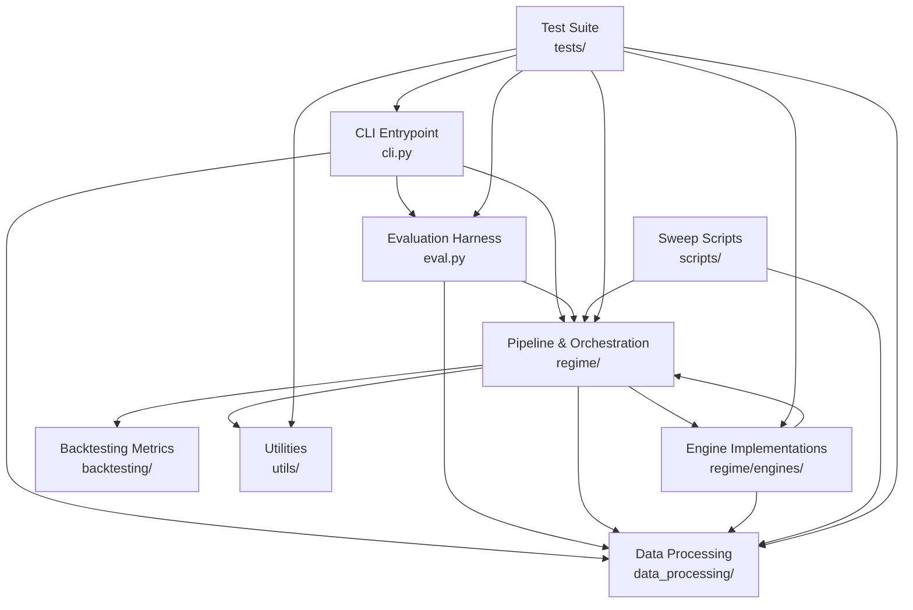

> generated_by: nexus-mapper v2
> verified_at: 2026-06-06
> provenance: AST-backed

# System Dependencies

## Mermaid Dependency Graph

## Key Dependency Rules

1. **Engines are isolated from pipeline**: No engine imports `pipeline.py`. Engines only depend on `engine_protocol.py` (Protocol + dataclasses) and `data_processing/` (features).
2. **Pipeline is the hub**: 32 modules depend on `pipeline.py` — all scripts, all tests, the CLI, and eval harness.
3. **Layering is clean**: Direction is always CLI/Pipeline/Engines → data_processing. No upward imports from data_processing.
4. **No circular imports**: The ENGINE_REGISTRY uses lazy imports to avoid cycles between engines and protocol.

## Coupling Analysis (Git Co-change)

### Hot pairs (score > 0.80)

| Score | Pair | Co-changes |
|-------|------|-----------|
| **1.00** | pipeline.py ↔ walk_forward.py | 14 |
| **1.00** | hmm_generic.py ↔ hmm_messina.py | 13 |
| **0.94** | pipeline.py ↔ engine_protocol.py | 17 |
| **0.90** | engine_protocol.py ↔ test_regime_engine.py | 9 |
| **0.89** | pipeline.py ↔ test_regime_pipeline.py | 8 |
| **0.82** | fshmm.py ↔ robust_hmm.py | 9 |
| **0.82** | fshmm.py ↔ pipeline.py | 9 |
| **0.82** | hmm_generic.py ↔ robust_hmm.py | 9 |
| **0.82** | hmm_messina.py ↔ robust_hmm.py | 9 |
| **0.80** | pipeline.py ↔ test_regime_engine.py | 8 |

### Interpretation

- **pipeline.py + walk_forward.py at 1.00**: These files always change together — walk_forward is effectively an internal implementation detail of pipeline.
- **hmm_generic + hmm_messina at 1.00**: Mirror engines that evolve in lockstep (same shared base class).
- **All HMM engines co-evolve with pipeline**: Changes to the pipeline interface propagate through all engine implementations.
