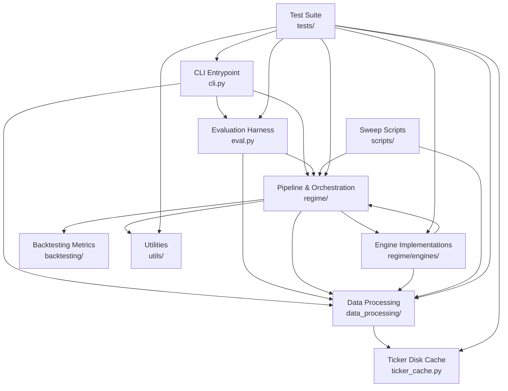

> generated_by: nexus-mapper v2
> verified_at: 2026-06-06
> provenance: AST-backed

# System Dependencies

## Mermaid Dependency Graph

## Key Changes Since Last Run

- **ticker_cache.py** added under `data_processing/`. csv_auto_detect.load_prices() delegates ticker downloads to `ticker_cache.get_ticker_data()`.
- **eval.py**: `_save_ticker_csv()` removed — ticker fetching now goes through ticker_cache.

## Dependency Rules

1. **Engines isolated from pipeline**: No engine imports `pipeline.py`.
2. **No circular imports**: ENGINE_REGISTRY uses lazy imports.
3. **Downward flow**: CLI/Pipeline/Engines → data_processing → ticker_cache.

## Coupling Analysis

| Score | Pair | Co-changes |
|-------|------|-----------|
| **1.00** | pipeline.py ↔ walk_forward.py | 14 |
| **1.00** | hmm_generic.py ↔ hmm_messina.py | 13 |
| **0.94** | pipeline.py ↔ engine_protocol.py | 17 |
| **0.90** | engine_protocol.py ↔ test_regime_engine.py | 9 |
| **0.89** | pipeline.py ↔ test_regime_pipeline.py | 8 |
| **0.82** | fshmm.py ↔ robust_hmm.py | 9 |
| **0.82** | fshmm.py ↔ pipeline.py | 9 |
| **0.82** | hmm_generic.py ↔ robust_hmm.py | 9 |
| **0.82** | hmm_messina.py ↔ robust_hmm.py | 9 |
| **0.80** | pipeline.py ↔ test_regime_engine.py | 8 |
